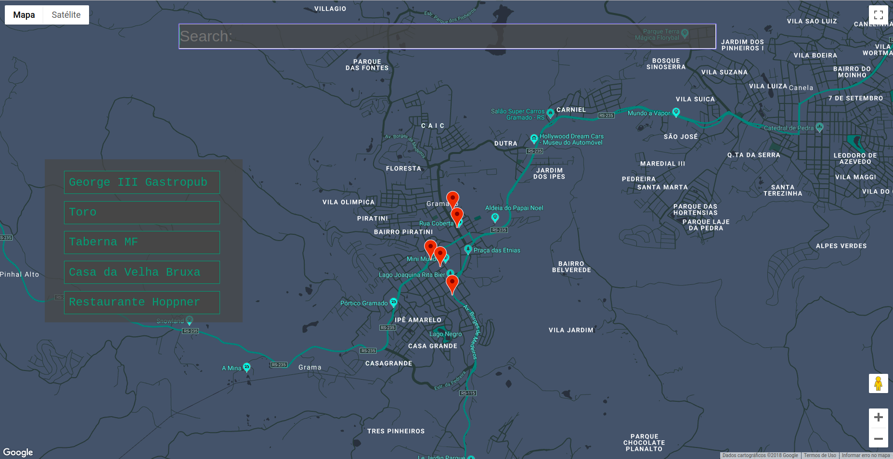
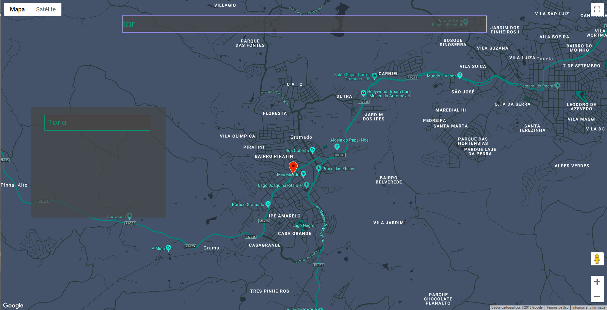
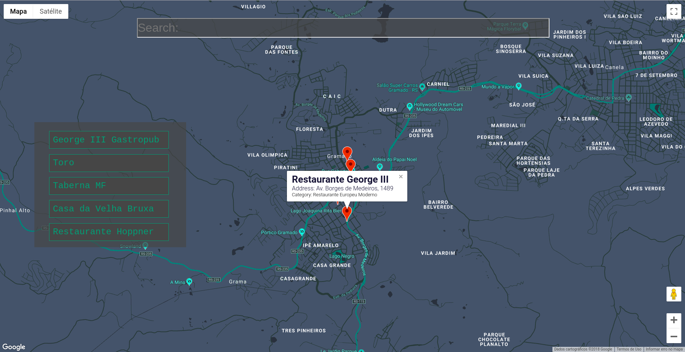
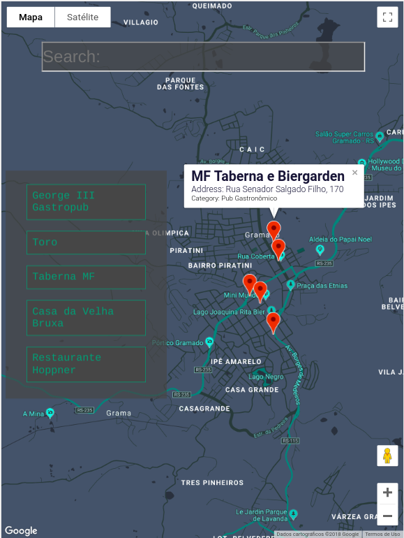
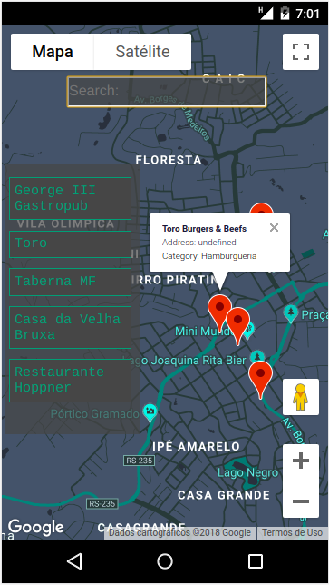

# Neighborhood Map - React JS
This web app is a project for Udacity - Full Stack Web Developer Nanodegree.

## About
This application uses React JS to build a interactive map using Google Maps API, placing markers of my favorite places in Gramado - RS. You can click on the markers to look for additional information grabbed from Foursquare, and the web application also contains a clickable list with all the locations where you can pop-up information about some location just clicking on its name. The application also offers a search bar that makes easy to filter the location items and the markers placed on the map.

## Responsive
Adjustable screen for tablet and mobile

## Usage
1. You need to have a recent version (>=6.0) Node JS installed in your computer. If you don't, go to https://nodejs.org/en/download/;
2. After install Node JS, you can start a React JS application in your own computer;
3. Download or clone this repo from Github and go to the '/neighborhood-map-react' directory;
4. Install all the modules required to run this application by running '$ npm install';
5. After the installation, run '$ npm start' and the application must open your browser in http://localhost:3000/;

## Copyrights
The integration of React JS and Google Maps is from YouTube tutorials and some blogs explaining how to do this step.
The structure and design of this application follows the 'Thinking in React' tutorial from the React Official Documentation: https://reactjs.org/docs/thinking-in-react.html
